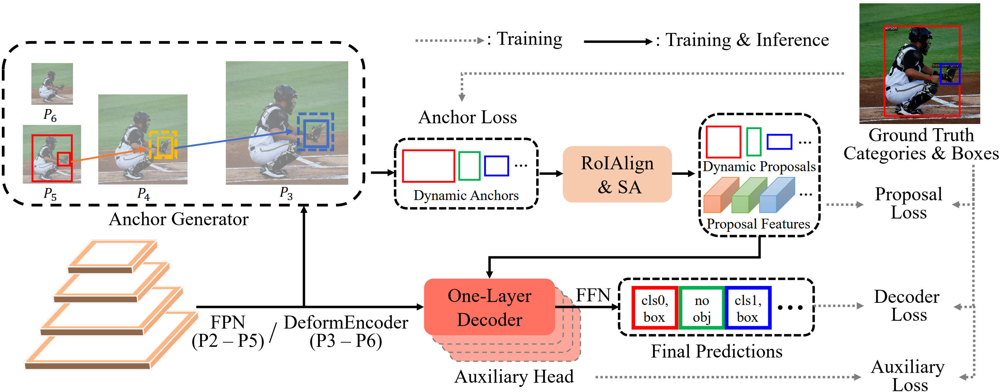
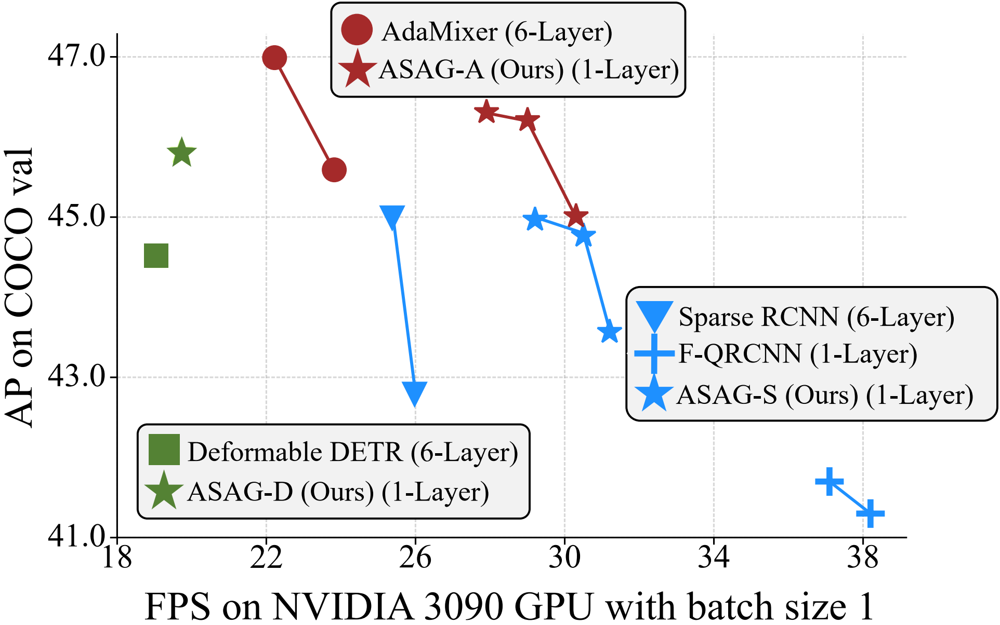
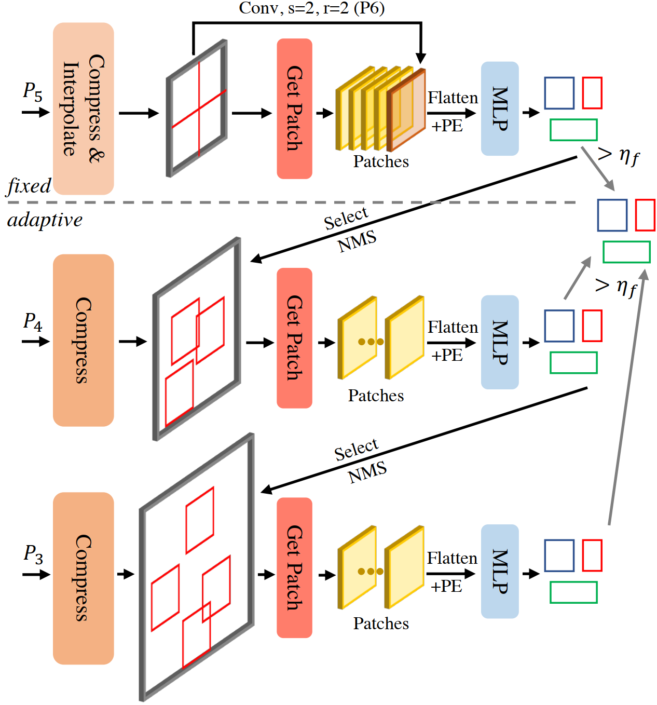

## ASAG: Building Strong One-Decoder-Layer Sparse Detectors via Adaptive Sparse Anchor Generation

This is the official PyTorch implementation of [ASAG](http://arxiv.org/abs/2308.09242) (ICCV 2023).



### 1 Introduction

- Recent sparse detectors with multiple, e.g. six, decoder layers achieve promising performance but much inference time due to complex heads. Previous works have explored using dense priors as initialization and built one-decoder-layer detectors. Although they gain remarkable acceleration, their performance still lags behind their six-decoder-layer counterparts by a large margin. In this work, we aim to bridge this performance gap while retaining fast speed. We find that the architecture discrepancy between dense and sparse detectors leads to feature conflict, hampering the performance of one-decoder-layer detectors. Thus we propose Adaptive Sparse Anchor Generator (ASAG) which predicts dynamic anchors on patches rather than grids in a sparse way so that it alleviates the feature conflict problem. For each image, ASAG dynamically selects which feature maps and which locations to predict, forming a fully adaptive way to generate image-specific anchors. Further, a simple and effective Query Weighting method eases the training instability from adaptiveness. Extensive experiments show that our method outperforms dense-initialized ones and achieves a better speed-accuracy trade-off.
- Our ASAG starts predicting dynamic anchors from fixed feature maps and then adaptively explores large feature maps using Adaptive Probing, which runs top-down and coarse-to-fine. We can even discard large feature maps manually for efficient inference.

<center>
<figure>


</figure>
</center>

### 2 Model Zoo

<table>
  <thead>
    <tr>
      <th></th>
      <th>name</th>
      <th>backbone</th>
      <th>epoch</th>
      <th>#queries</th>
      <th>box AP</th>
      <th>Where in <a href="http://arxiv.org/abs/2308.09242">Our Paper</a></th>
    </tr>
  </thead>
  <tbody>
    <tr>
      <th>1</th>
      <td>ASAG-A</td>
      <td>R50</td>
      <td>12</td>
      <td>107</td>
      <td>42.6</td>
      <td>Table 2</td>
    </tr>
    <tr>
      <th>2</th>
      <td>ASAG-A</td>
      <td>R50</td>
      <td>12</td>
      <td>329</td>
      <td>43.6</td>
      <td>Table 2</td>
    </tr>
    <tr>
      <th>3</th>
      <td>ASAG-A<sup></td>
      <td>R50</td>
      <td>36</td>
      <td>102</td>
      <td>45.3</td>
      <td>Table 4</td>
    </tr>
    <tr>
      <th>4</th>
      <td>ASAG-A</td>
      <td>R50</td>
      <td>36</td>
      <td>312</td>
      <td>46.3</td>
      <td>Table 4</td>
    </tr>
    <tr>
      <th>5</th>
      <td>ASAG-A</td>
      <td>R101</td>
      <td>36</td>
      <td>296</td>
      <td>47.5</td>
      <td>Table 4</td>
    </tr>
    <tr>
      <th>6</th>
      <td>ASAG-S</td>
      <td>R50</td>
      <td>36</td>
      <td>100</td>
      <td>43.9</td>
      <td>Table 3 & 4</td>
    </tr>
    <tr>
      <th>7</th>
      <td>ASAG-S</td>
      <td>R50</td>
      <td>36</td>
      <td>312</td>
      <td>45.0</td>
      <td>Table 3 & 4</td>
    </tr>
    <tr>
      <th>8</th>
      <td>ASAG-A-dn</td>
      <td>R50</td>
      <td>12</td>
      <td>106</td>
      <td>43.1</td>
      <td>Table A-1</td>
    <tr>
      <th>9</th>
      <td>ASAG-A-crosscl</td>
      <td>R50</td>
      <td>12</td>
      <td>103</td>
      <td>43.8</td>
      <td></td>
    </tr>
  </tbody>
</table>

- Notes: 
  
  - All the checkpoints and logs are be found in [Google Drive](https://drive.google.com/drive/folders/1rkWQt7Z3R_tiWMpVyyqyo54H9XCVYJwG?usp=sharing) / [Baidu (pwd: asag)](https://pan.baidu.com/s/1XMGA1__1SABrg0o7zeD_kw)
  - Results in the above table are tested on COCO datasets.
  - In ASAG, we use 4 parallel decoders, most of which perform similarly (~0.2AP).
  - To test speed, users need to slightly modify the code, including:
    - use only one decoder: `--num_decoder_layers 1`
    - use `fast_inference` api rather than `forward` in `models/anchor_generator.py`
  

### 3 Data preparation

Download and extract COCO 2017 train and val images with annotations from [here](http://cocodataset.org/#download).

We expect the directory structure to be the following:

```
path/to/coco/
  annotations/  # annotation json files
  train2017/    # train images
  val2017/      # val images
```

### 4 Usage

- To prevent users from confusing different ImageNet pretrained checkpoints, we require users to download the corresponding version of the checkpoint from [TorchVision](https://pytorch.org/vision/stable/models.html#table-of-all-available-classification-weights) manually. 
- Our environment
  - NVIDIA RTX 3090
  - python: 3.7.12
  - Torch: 1.10.2 + cu113
  - Torchvision: 0.11.3 + cu113

<details>
<summary>ASAG-A (1x, R50, 100 queries)</summary>
<p>
  Training
  </p>
<code>
python -m torch.distributed.launch --nproc_per_node=4 --use_env main.py --coco_path YOUR_COCO_PATH --batch_size 4 --output_dir output --backbone resnet50 --pretrained_checkpoint YOUR_DOWNLOADED_CHECKPOINT 
</code>
  <p>
  Inference
  </p>
<code>
python -m torch.distributed.launch --nproc_per_node=4 --use_env main.py --coco_path YOUR_COCO_PATH --batch_size 4 --output_dir output --backbone resnet50 --eval --resume ASAG_A_r50_1x_100.pth --used_head aux_2
</code>
</details>

<details>
<summary>ASAG-A (1x, R50, 300 queries)</summary>
<p>
  Training
  </p>
<code>
python -m torch.distributed.launch --nproc_per_node=4 --use_env main.py --coco_path YOUR_COCO_PATH --batch_size 4 --output_dir output --backbone resnet50 --pretrained_checkpoint YOUR_DOWNLOADED_CHECKPOINT --num_query 300
</code>
  <p>
  Inference
  </p>
<code>
python -m torch.distributed.launch --nproc_per_node=4 --use_env main.py --coco_path YOUR_COCO_PATH --batch_size 4 --output_dir output --backbone resnet50 --eval --resume ASAG_A_r50_1x_300.pth --used_head aux_2 --num_query 300
</code>
</details>

<details>
<summary>ASAG-A (3x, R50, 100 queries)</summary>
<p>
  Training
  </p>
<code>
python -m torch.distributed.launch --nproc_per_node=4 --use_env main.py --coco_path YOUR_COCO_PATH --batch_size 4 --output_dir output --backbone resnet50 --pretrained_checkpoint YOUR_DOWNLOADED_CHECKPOINT --training_schedule 3x
</code>
  <p>
  Inference
  </p>
<code>
python -m torch.distributed.launch --nproc_per_node=4 --use_env main.py --coco_path YOUR_COCO_PATH --batch_size 4 --output_dir output --backbone resnet50 --eval --resume ASAG_A_r50_3x_100.pth --used_head main
</code>
</details>

<details>
<summary>ASAG-A (3x, R50, 300 queries)</summary>
<p>
  Training
  </p>
<code>
python -m torch.distributed.launch --nproc_per_node=4 --use_env main.py --coco_path YOUR_COCO_PATH --batch_size 4 --output_dir output --backbone resnet50 --pretrained_checkpoint YOUR_DOWNLOADED_CHECKPOINT --num_query 300 --training_schedule 3x
</code>
  <p>
  Inference
  </p>
<code>
python -m torch.distributed.launch --nproc_per_node=4 --use_env main.py --coco_path YOUR_COCO_PATH --batch_size 4 --output_dir output --backbone resnet50 --eval --resume ASAG_A_r50_3x_300.pth --used_head aux_2 --num_query 300
</code>
</details>

<details>
<summary>ASAG-A (3x, R101, 300 queries)</summary>
<p>
  Training
  </p>
<code>
python -m torch.distributed.launch --nproc_per_node=4 --use_env main.py --coco_path YOUR_COCO_PATH --batch_size 4 --output_dir output --backbone resnet101 --pretrained_checkpoint YOUR_DOWNLOADED_CHECKPOINT --num_query 300 --training_schedule 3x
</code>
  <p>
  Inference
  </p>
<code>
python -m torch.distributed.launch --nproc_per_node=4 --use_env main.py --coco_path YOUR_COCO_PATH --batch_size 4 --output_dir output --backbone resnet101 --eval --resume ASAG_A_r101_3x_300.pth --used_head aux_2 --num_query 300
</code>
</details>

<details>
<summary>ASAG-S (3x, R50, 100 queries)</summary>
<p>
  Training
  </p>
<code>
python -m torch.distributed.launch --nproc_per_node=4 --use_env main.py --coco_path YOUR_COCO_PATH --batch_size 4 --output_dir output --backbone resnet50 --pretrained_checkpoint YOUR_DOWNLOADED_CHECKPOINT --training_schedule 3x --decoder_type SparseRCNN
</code>
  <p>
  Inference
  </p>
<code>
python -m torch.distributed.launch --nproc_per_node=4 --use_env main.py --coco_path YOUR_COCO_PATH --batch_size 4 --output_dir output --backbone resnet50 --eval --decoder_type SparseRCNN --resume ASAG_S_r50_3x_100.pth --used_head aux_2
</code>
</details>

<details>
<summary>ASAG-S (3x, R50, 300 queries)</summary>
<p>
  Training
  </p>
<code>
python -m torch.distributed.launch --nproc_per_node=4 --use_env main.py --coco_path YOUR_COCO_PATH --batch_size 4 --output_dir output --backbone resnet50 --pretrained_checkpoint YOUR_DOWNLOADED_CHECKPOINT --num_query 300 --training_schedule 3x --decoder_type SparseRCNN
</code>
  <p>
  Inference
  </p>
<code>
python -m torch.distributed.launch --nproc_per_node=4 --use_env main.py --coco_path YOUR_COCO_PATH --batch_size 4 --output_dir output --backbone resnet50 --eval --resume ASAG_S_r50_3x_300.pth --used_head aux_2 --num_query 300 --decoder_type SparseRCNN
</code>
</details>

<details>
<summary>ASAG-A+dn (1x, R50, 100 queries)</summary>
<p>
  Training
  </p>
<code>
python -m torch.distributed.launch --nproc_per_node=4 --use_env main.py --coco_path YOUR_COCO_PATH --batch_size 4 --output_dir output --backbone resnet50 --pretrained_checkpoint YOUR_DOWNLOADED_CHECKPOINT --use_dn --fix_noise_scale
</code>
  <p>
  Inference
  </p>
<code>
python -m torch.distributed.launch --nproc_per_node=4 --use_env main.py --coco_path YOUR_COCO_PATH --batch_size 4 --output_dir output --backbone resnet50 --eval --resume ASAG_A_r50_1x_100_dn.pth --used_head aux_2
</code>
</details>

### 5 Efficient inference

- Taking ASAG-A (1x, R50, 100 queries) as an example.

- `--used_inference_level ` can choose from `['P3P6', 'P4P6', 'P5P6']`.

  ```
  python -m torch.distributed.launch --nproc_per_node=4 --use_env main.py --coco_path YOUR_COCO_PATH --batch_size 4 --output_dir output --backbone resnet50 --eval --resume ASAG_A_r50_1x_100.pth --used_head aux_2 --used_inference_level P5P6
  ```

### 6 CrowdHuman Results

<table>
  <thead>
    <tr>
      <th></th>
      <th>name</th>
      <th>AP(↑)</th>
      <th>mMR(↓)</th>
      <th>R(↑)</th>
      <th>Where in <a href="http://arxiv.org/abs/2308.09242">Our Paper</a></th>
    </tr>
  </thead>
  <tbody>
    <tr>
      <th>1</th>
      <td>Deformable DETR</td>
      <td>86.7</td>
      <td>54.0</td>
      <td>92.5</td>
      <td>Table 6</td>
    </tr>
    <tr>
      <th>2</th>
      <td>Sparse RCNN</td>
      <td>89.2</td>
      <td>48.3</td>
      <td>95.9</td>
      <td>Table 6</td>
    </tr>
    <tr>
      <th>3</th>
      <td>ASAG-S<sup></td>
      <td>91.3</td>
      <td>43.5</td>
      <td>96.9</td>
      <td>Table 6</td>
    </tr>
  </tbody>
</table>

- We also run ASAG-S on [CrowdHuman](http://www.crowdhuman.org) dataset with R50, 50 epochs and the average number of anchors within 500.

- Data preparation
  After downloading the dataset, users should first convert the annotations to the coco format by running `crowdhumantools/convert_crowdhuman_to_coco.py`. Before running it, please make sure the file paths in it are correct.

  ```
  path/to/crowdhuman/
    annotations/  				# annotation json files
    CrowdHuman_train/    	# train images
    CrowdHuman_val/      	# val images
  ```

- Training

  ```
  python -m torch.distributed.launch --nproc_per_node=4 --use_env main.py --dataset_file crowdhuman --coco_path YOUR_CROWDHUMAN_PATH --batch_size 4 --output_dir output --backbone resnet50 --pretrained_checkpoint YOUR_DOWNLOADED_CHECKPOINT --decoder_type SparseRCNN
  ```

- Inference

  ```
  python -m torch.distributed.launch --nproc_per_node=4 --use_env main.py --dataset_file crowdhuman --coco_path YOUR_CROWDHUMAN_PATH --batch_size 4 --output_dir output --backbone resnet50 --eval --resume ASAG_S_crowdhuman.pth --used_head aux_0 --decoder_type SparseRCNN
  ```

### 7 Equipping with stronger backbone

<table>
  <thead>
    <tr>
      <th></th>
      <th>backbone</th>
      <th>AP</th>
      <th>APs</th>
      <th>APm</th>
      <th>APl</th>
    </tr>
  </thead>
  <tbody>
    <tr>
      <th>1</th>
      <td>torchvision R50</td>
      <td>42.6</td>
      <td>25.9</td>
      <td>45.8</td>
      <td>56.9</td>
    </tr>
    <tr>
      <th>2</th>
      <td>CrossCL R50</td>
      <td>43.8</td>
      <td>26.1</td>
      <td>47.4</td>
      <td>59.3</td>
    </tr>
  </tbody>
</table>

- We run ASAG-A with our self-supervised pretrained backbone [CrossCL](https://github.com/iSEE-Laboratory/CrossCL) under 1x schedule, which can boost ASAG by 1.2 AP.

- The pretrained backbone can be found in [Google Drive](https://drive.google.com/drive/folders/1rkWQt7Z3R_tiWMpVyyqyo54H9XCVYJwG?usp=sharing) / [Baidu (pwd: asag)](https://pan.baidu.com/s/1XMGA1__1SABrg0o7zeD_kw).

- Training

  ```
  python -m torch.distributed.launch --nproc_per_node=4 --use_env main.py --coco_path YOUR_COCO_PATH --batch_size 4 --output_dir output --backbone resnet50 --pretrained_checkpoint crosscl_resnet50.pth
  ```

- Inference

  ```
  python -m torch.distributed.launch --nproc_per_node=4 --use_env main.py --coco_path YOUR_COCO_PATH --batch_size 4 --output_dir output --backbone resnet50 --eval --resume ASAG_A_r50_1x_100_crosscl.pth --used_head aux_2
  ```

### 8 License

ASAG is released under the Apache 2.0 license. Please see the LICENSE file for more information.

### 9 Bibtex

If you find our work helpful for your research, please consider citing the following BibTeX entry.

```
@inproceedings{fu2023asag,
  title={ASAG: Building Strong One-Decoder-Layer Sparse Detectors via Adaptive Sparse Anchor Generation},
  author={Fu, Shenghao and Yan, Junkai and Gao, Yipeng and Xie, Xiaohua and Zheng, Wei-Shi},
  booktitle={ICCV},
  year={2023},
}

@inproceedings{yan2023cross,
  title={Self-supervised Cross-stage Regional Contrastive Learning for Object Detection},
  author={Yan, Junkai and Yang, Lingxiao and Gao, Yipeng and Zheng, Wei-Shi},
  booktitle={ICME},
  year={2023},
}
```

### 10 Acknowledgement

Our ASAG is heavily inspired by many outstanding prior works, including

- [DETR](https://github.com/facebookresearch/detr)
- [AdaMixer](https://github.com/MCG-NJU/AdaMixer)
- [DN-DETR](https://github.com/IDEA-Research/DN-DETR)
- [DW](https://github.com/strongwolf/DW)
- [Sparse R-CNN](https://github.com/PeizeSun/SparseR-CNN)
- [Deformable DETR](https://github.com/fundamentalvision/Deformable-DETR)

Thank the authors of above projects for open-sourcing their implementation codes!
